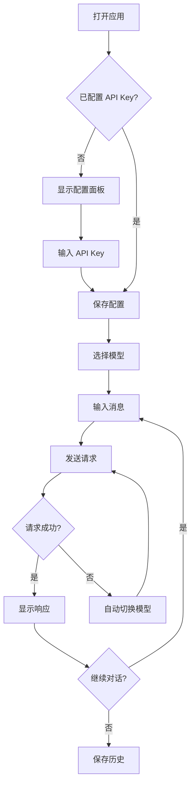

# AI CLI Web 应用 - 产品需求文档

## 1. 产品概述
一个复刻 Claude 界面风格的 AI 聊天 Web 应用，支持多模型切换、对话历史管理、Token 使用统计等功能。用户可以在优雅的界面中与多种大语言模型进行交互。

- 目标用户：需要频繁使用 AI 助手的开发者、内容创作者
- 核心价值：提供美观、流畅、功能丰富的 AI 聊天体验

## 2. 核心功能

### 2.1 用户角色
| 角色 | 注册方式 | 核心权限 |
|------|----------|----------|
| 用户 | 无需注册 | 配置 API Key 后使用全部功能 |

### 2.2 功能模块
1. **聊天页面**：对话界面、消息输入、模型切换、设置面板
2. **历史页面**：对话历史列表、搜索、删除管理

### 2.3 页面详情
| 页面名称 | 模块名称 | 功能描述 |
|----------|----------|----------|
| 聊天页面 | 消息列表 | 显示用户和 AI 的对话消息，支持 Markdown 渲染、代码高亮 |
| 聊天页面 | 输入区域 | 多行文本输入、发送按钮、快捷键支持 |
| 聊天页面 | 侧边栏 | 新建对话、历史对话列表、模型选择器 |
| 聊天页面 | 设置面板 | API 配置、模型优先级设置、Token 统计显示 |
| 历史页面 | 历史列表 | 按时间分组显示历史对话，支持搜索和删除 |

## 3. 核心流程

用户打开应用 → 配置 API Key（首次使用）→ 选择模型 → 输入问题 → AI 响应 → 继续对话或切换模型

## 4. 用户界面设计

### 4.1 设计风格
- **主题**：Claude 风格 - 温暖的米色/奶油色调，简洁优雅
- **主色调**：#D97706（琥珀色/橙色）作为强调色，#FAFAF8 作为背景色
- **按钮风格**：圆角按钮，柔和阴影，hover 时有微妙的上浮效果
- **字体**：使用 Söhne 风格字体（可用 Inter 或 DM Sans 替代），正文 16px
- **布局**：左侧固定侧边栏 + 右侧主聊天区域
- **图标**：使用 Lucide React 图标库，线性风格

### 4.2 页面设计概览
| 页面名称 | 模块名称 | UI 元素 |
|----------|----------|---------|
| 聊天页面 | 侧边栏 | 宽度 260px，背景 #F5F5F0，新建对话按钮，历史列表 |
| 聊天页面 | 消息区域 | 居中宽度 max 768px，用户消息右对齐，AI 消息左对齐 |
| 聊天页面 | 输入框 | 底部固定，圆角 24px，自动高度调整 |
| 聊天页面 | 模型选择器 | 下拉菜单，显示当前模型，支持快速切换 |
| 聊天页面 | 设置面板 | 滑出式抽屉，API 配置表单，Token 统计图表 |

### 4.3 响应式设计
- 桌面优先设计，侧边栏可折叠
- 移动端：侧边栏默认隐藏，点击汉堡菜单展开
- 触摸优化：消息区域支持滑动删除历史对话

### 4.4 动效设计
- 消息出现：淡入 + 轻微上移动画
- AI 打字效果：逐字显示，带有闪烁光标
- 模型切换：平滑过渡动画
- 侧边栏展开/收起：滑动动画
