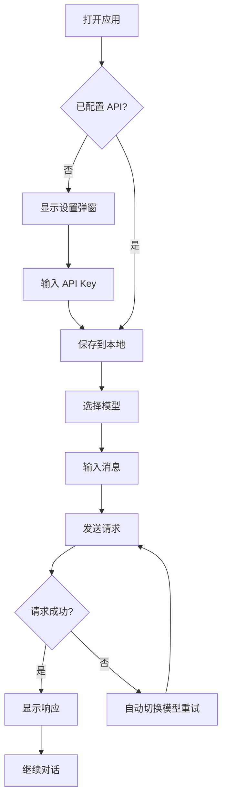

# AI CLI Web 应用 - 产品需求文档

## 1. 产品概述
一个完全复刻 Claude 界面风格的本地 AI 聊天 Web 应用。界面设计、配色、布局、交互方式均参考 Claude 官方界面，支持多模型切换、对话历史管理、Token 使用统计等功能。

- 目标用户：需要本地化 AI 聊天工具的开发者
- 核心价值：提供与 Claude 一致的使用体验，但支持自定义 API 后端

## 2. 核心功能

### 2.1 功能模块
1. **聊天页面**：完全复刻 Claude 的对话界面
2. **侧边栏**：对话历史、新建对话、模型切换

### 2.2 页面详情
| 页面名称 | 模块名称 | 功能描述 |
|----------|----------|----------|
| 聊天页面 | 消息列表 | Claude 风格的消息展示，用户消息无背景色，AI 消息带背景 |
| 聊天页面 | 输入区域 | Claude 风格的底部输入框，支持附件按钮 |
| 聊天页面 | 侧边栏 | Claude 风格的左侧边栏，对话历史列表 |
| 聊天页面 | 顶部栏 | Claude 风格的模型选择下拉菜单 |

## 3. 核心流程

## 4. 用户界面设计

### 4.1 Claude 界面风格复刻

**整体布局**：
- 左侧固定侧边栏（260px 宽度）
- 右侧主聊天区域
- 顶部简洁导航栏

**配色方案（Claude 官方配色）**：
- 背景：#FFFFFF（主区域）/ #F4F4F4（侧边栏）
- 强调色：#D97706（Claude 橙色）
- 文字：#1F1F1F（主文字）/ #666666（次要文字）
- 边框：#E5E5E5
- 用户消息：无背景，右对齐
- AI 消息：#F4F4F4 背景，左对齐

**字体**：
- 标题：Söhne（使用 Geist 或 Inter 替代）
- 正文：Söhne（使用 Inter 替代）
- 代码：JetBrains Mono

**Claude 特有元素**：
- 圆角输入框（24px 圆角）
- 柔和的阴影效果
- 简洁的图标设计
- 流畅的过渡动画

### 4.2 页面设计详情

| 页面名称 | 模块名称 | UI 元素 |
|----------|----------|---------|
| 聊天页面 | 侧边栏 | 背景色 #F4F4F4，顶部新建对话按钮，历史对话列表，底部设置入口 |
| 聊天页面 | 消息区域 | 最大宽度 800px 居中，消息间距 24px，支持 Markdown 渲染 |
| 聊天页面 | 输入框 | 底部固定，白色背景，24px 圆角，左侧附件图标，右侧发送按钮 |
| 聊天页面 | 顶部栏 | 左侧汉堡菜单（移动端），中间模型选择器，右侧设置按钮 |
| 聊天页面 | 模型选择 | 下拉菜单样式，显示当前模型名称，点击展开模型列表 |

### 4.3 Claude 风格消息样式

**用户消息**：
- 无背景色
- 右对齐
- 最大宽度 70%
- 底部显示时间戳

**AI 消息**：
- 背景 #F4F4F4
- 左对齐
- 最大宽度 100%
- 顶部显示模型名称标签
- 支持代码块语法高亮
- 支持 Markdown 表格、列表等

### 4.4 响应式设计
- 桌面：完整侧边栏 + 主区域
- 平板：可折叠侧边栏
- 手机：侧边栏默认隐藏，汉堡菜单触发

### 4.5 动效
- 消息出现：淡入效果
- AI 响应：打字机效果
- 侧边栏：滑动展开/收起
- 按钮：hover 时微妙放大
