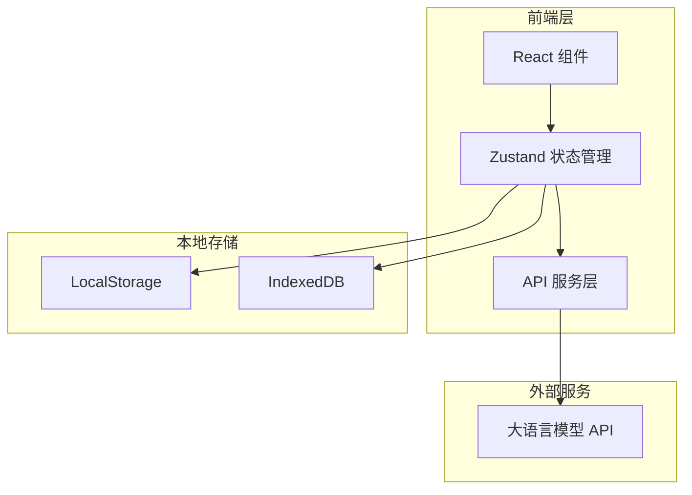

# AI CLI Web 应用 - 技术架构文档

## 1. 架构设计



## 2. 技术说明

- **前端框架**：React 18 + TypeScript + Vite
- **样式方案**：Tailwind CSS 3 + 自定义 CSS 变量
- **状态管理**：Zustand（轻量级状态管理）
- **Markdown 渲染**：react-markdown + remark-gfm + react-syntax-highlighter
- **图标库**：Lucide React
- **动画**：Framer Motion
- **本地存储**：LocalStorage（配置）+ IndexedDB（对话历史）
- **HTTP 客户端**：原生 fetch API

## 3. 路由定义

| 路由 | 用途 |
|------|------|
| `/` | 主聊天页面 |
| `/chat/:id` | 打开指定对话 |
| `/settings` | 设置页面 |

## 4. API 定义

### 4.1 OpenAI 兼容 API

```typescript
interface ChatCompletionRequest {
  model: string;
  messages: Array<{
    role: 'user' | 'assistant' | 'system';
    content: string;
  }>;
  temperature?: number;
  stream?: boolean;
}

interface ChatCompletionResponse {
  id: string;
  choices: Array<{
    message: {
      role: 'assistant';
      content: string;
    };
    finish_reason: string;
  }>;
  usage: {
    prompt_tokens: number;
    completion_tokens: number;
    total_tokens: number;
  };
}

interface ModelsResponse {
  data: Array<{
    id: string;
    object: string;
  }>;
}
```

### 4.2 本地存储接口

```typescript
interface Config {
  apiBase: string;
  apiKey: string;
  modelPriority: string[];
  currentModel: string;
}

interface Conversation {
  id: string;
  title: string;
  messages: Message[];
  createdAt: Date;
  updatedAt: Date;
}

interface Message {
  id: string;
  role: 'user' | 'assistant';
  content: string;
  timestamp: Date;
  model?: string;
  tokens?: number;
}

interface TokenUsage {
  [model: string]: {
    [date: string]: number;
  };
}
```

## 5. 项目结构

```
ai-cli-web/
├── src/
│   ├── components/
│   │   ├── Chat/
│   │   │   ├── MessageList.tsx
│   │   │   ├── MessageItem.tsx
│   │   │   ├── ChatInput.tsx
│   │   │   └── TypingIndicator.tsx
│   │   ├── Sidebar/
│   │   │   ├── Sidebar.tsx
│   │   │   ├── ConversationList.tsx
│   │   │   └── ModelSelector.tsx
│   │   ├── Settings/
│   │   │   ├── SettingsPanel.tsx
│   │   │   ├── ApiConfig.tsx
│   │   │   └── TokenStats.tsx
│   │   └── ui/
│   │       ├── Button.tsx
│   │       ├── Input.tsx
│   │       ├── Select.tsx
│   │       └── Modal.tsx
│   ├── hooks/
│   │   ├── useChat.ts
│   │   ├── useConfig.ts
│   │   └── useStorage.ts
│   ├── services/
│   │   ├── api.ts
│   │   └── storage.ts
│   ├── stores/
│   │   ├── chatStore.ts
│   │   └── configStore.ts
│   ├── types/
│   │   └── index.ts
│   ├── utils/
│   │   └── helpers.ts
│   ├── App.tsx
│   ├── main.tsx
│   └── index.css
├── public/
├── index.html
├── package.json
├── tsconfig.json
├── tailwind.config.js
└── vite.config.ts
```

## 6. 核心组件说明

### 6.1 状态管理 (Zustand)

```typescript
interface ChatStore {
  conversations: Conversation[];
  currentConversationId: string | null;
  messages: Message[];
  isLoading: boolean;
  
  createConversation: () => void;
  deleteConversation: (id: string) => void;
  selectConversation: (id: string) => void;
  sendMessage: (content: string) => Promise<void>;
}

interface ConfigStore {
  apiBase: string;
  apiKey: string;
  modelPriority: string[];
  currentModel: string;
  tokenUsage: TokenUsage;
  
  setApiKey: (key: string) => void;
  setApiBase: (base: string) => void;
  switchModel: () => void;
  updateTokenUsage: (model: string, tokens: number) => void;
}
```

### 6.2 API 服务

```typescript
class AIService {
  private apiBase: string;
  private apiKey: string;

  async getModels(): Promise<string[]>;
  async chatCompletion(messages: Message[], model: string): Promise<string>;
  async chatCompletionStream(
    messages: Message[], 
    model: string,
    onChunk: (chunk: string) => void
  ): Promise<void>;
}
```
